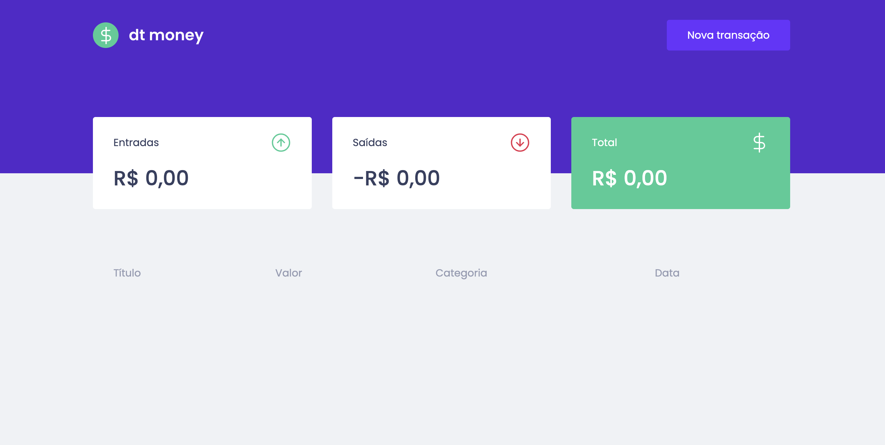
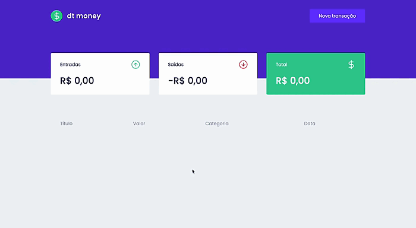

# Aplicação: dt money
## sistema financeiro para controle de gastos

Objetivo: desenvolver uma aplicação web para controle de gastos, registrando entradas e saídas, apresentando o saldo final, sendo positivo ou negativo.

## Design do projeto final
A idéia era construir a aplicação utilizando as tecnologias conforme fosse aprendendo.


## Tecnologias

Construção do projeto realizado utilizando as seguintes tecnologias:
- Javascript
- ReactJS
- TypeScript
- Styled Components
- Axios
- Hooks (useState, useEffect, useContext)

## Resultado

Após uma série de estudos e muita tentativa, o resultado até o momento é este:


## Executando o projeto
1. Faça o clone do repositório para a sua máquina local
2. Abra o projeto no visual studio code
3. instalar dependências do projeto com o comando ```yarn``` ou ```yarn install````
4. rodar o comando no terminal: ```yarn dev```
5. aproveite o projeto para estudos. :)